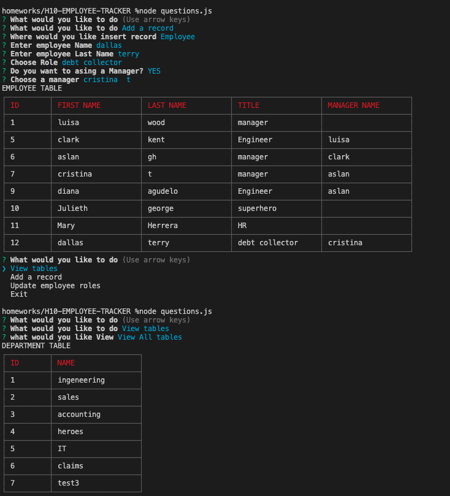

# H10-EMPLOYEE-TRACKER

This application will allow you to have an Employee Management System and track information about your employees. 

## GettingStarted

Project Location

>[Project's GitHub repository](https://github.com/crisdc88/H10-EMPLOYEE-TRACKER)

## Prerequisites

>mySql Database Engine

## Built With

>* Node js
>* mySql
>* cli-table package
>* Inquirer package

## Installation

>To run this application on your local machine follow these steps:

>1. Clone project from github.
>2. Copy sql statements found in ct_DB.sql and run the statements on your mySQL application.
>3. Open the terminal and go to the project's path
>4. run npm install
>5. run node questions.js
>6. Choose Options


## Deployed Link

>N/A

## Code-Snippets


```sh
"sample of a query used to insert, this function was so I could insert information to any table:"

  insertData(table, objectValues, cb) {
       
        let query = `INSERT INTO ${table}  SET ?`;
        connection.query(query, objectValues, function (err, resp) {
            if (err) throw err;
            // console.log(resp)
        })
        cb();
    }

"use of Call back functions:"

 inquirer.prompt(qDepartmentInfo).then(function (answer) {
        queries.insertData("department", { name: answer.deptName }, function () {
            queries.selectDepartment(function () {
                init(qStart);
            });
        })
    })

"implemented "value" functionality so I could pass an array of object to the attribute 'choice' on the inquirer.  This way the user will see a string of data and the inquirer will return whatever was assinged to the attribute value, for this case it will return an id. "

            resp.map(element => {
                temObj = {value:element.id, name:`${element.first_name}  ${element.last_name}`}; 
                result.push(temObj);               
            });
 

```

## Screen shots / GIFS

1. Console Input


2. Screen Shot


## Author


D. Cristina Terry

GitHub: [https://github.com/crisdc88/](https://github.com/crisdc88/),

LinkedIn: [www.linkedin.com/in/dcristinaterry](www.linkedin.com/in/dcristinaterry)

## License


